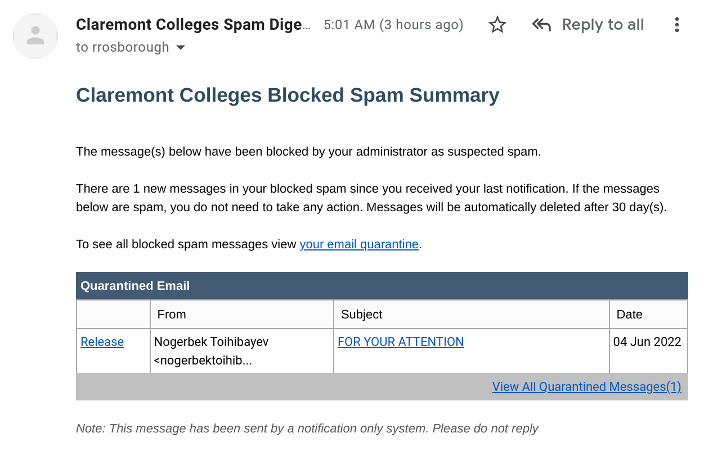

# Claremont Spam Disabler

Have you ever had the misfortune of seeing an email like this?

  

Most likely not, unless you at one point attended a college in the
[Claremont Colleges consortium](https://www.claremont.edu/). However,
if you do fall into the latter category, you'll be familiar with the
issue. Essentially, the college administration has installed their own
spam filter, which is largely useless since Gmail already has a spam
filter that works very well. And the way the extra spam filter works,
is every time you get a spam message, it sends you an email to your
inbox telling you about it. Thus rather defeating the entire point of
a spam filter, which is that you *don't* see spam emails.

The manual solution to this problem is to simply click the `Release`
button in the email, at which point you'll be forwarded the spam, and
Gmail will filter it out for you (unless it was in fact a false
positive, in which case you'll see it in your inbox). However, since
(at least at Harvey Mudd) you retain your school email address in
perpetuity after graduation, this problem of occasional spam
notifications never goes away, even if you've mostly migrated away
from using the address for anything important.

Enter Claremont Spam Disabler. This is a [Google Apps
Script](https://developers.google.com/apps-script) that leverages the
[Gmail
Service](https://developers.google.com/apps-script/reference/gmail) to
automate the advanced task of clicking the `Release` button and
archiving the email!

## Usage

Go to <https://script.google.com/home> and create a new project. Paste
in the contents of `Code.gs` to the editor, save it, click Run. You'll
have to approve the requested permissions on your Gmail account, and
then you should see a successful execution. If you want to test the
functionality end to end, find one of the `Claremont Colleges Blocked
Spam Summary` emails and move it to your inbox, then run the script
again. All referenced emails should be released (a no-op if they were
already released) and then the email should be archived. You should
see logs to this effect in the Apps Script editor.

After you've verified things are working, I would suggest setting up a
daily trigger for the script. I have mine set at `6am to 7am`
(GMT-07:00) because it appears that the emails are sent by a batch
system shortly after 5am PT.

## Monitoring

Google Apps Script should notify you by email if the script encounters
errors. No other monitoring solutions are set up at present.

## Limitations

You will, of course, still see these emails in your inbox during the
time window between 5am to when the script runs in the morning. An
improvement would be to create a Gmail filter to have the emails skip
the inbox, and apply a special label. Then, the Apps Script could
query for conversations with that label (instead of in the inbox), and
remove the label once it's done with processing. I plan to make this
improvement if the problem ever bothers me, but usually I am not awake
and checking my email shortly after 5am.
